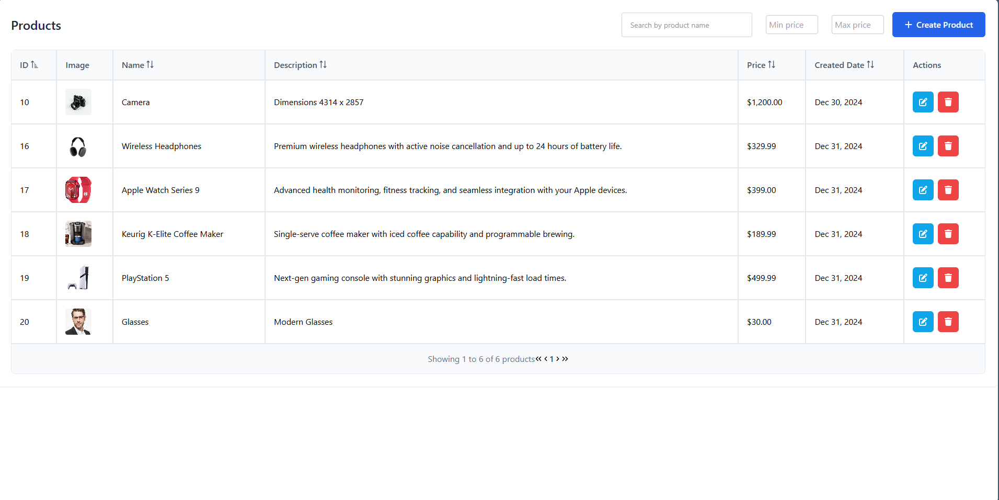
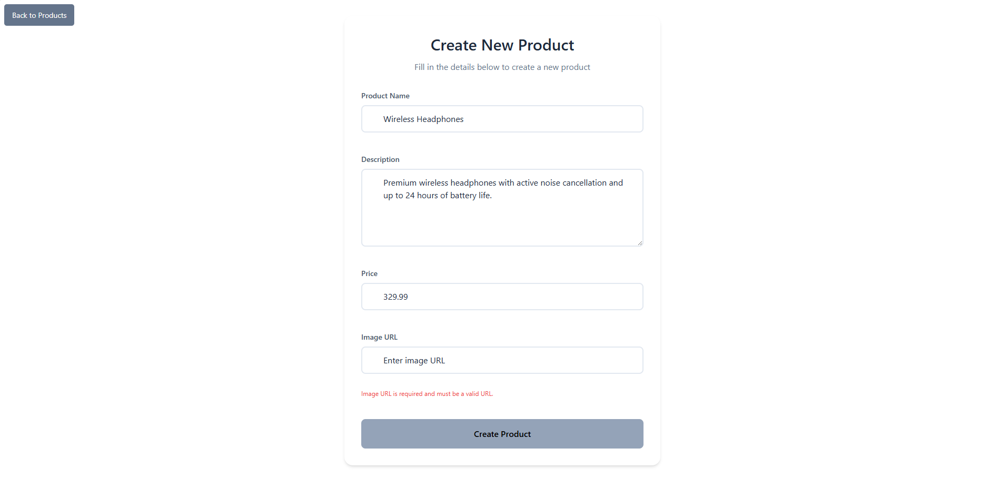
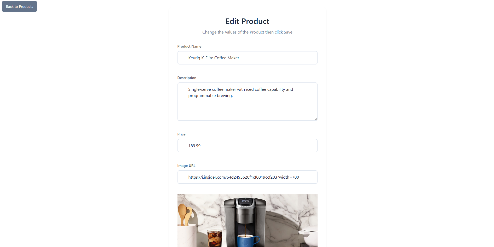
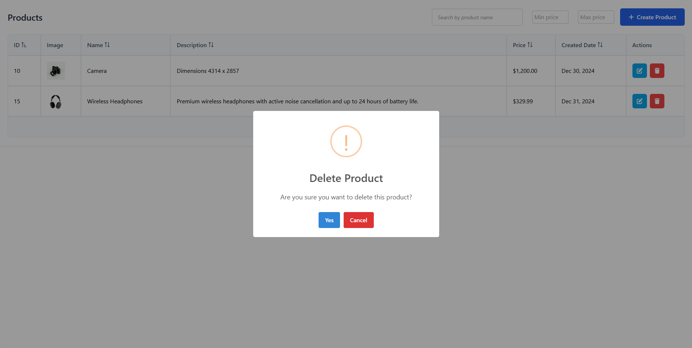
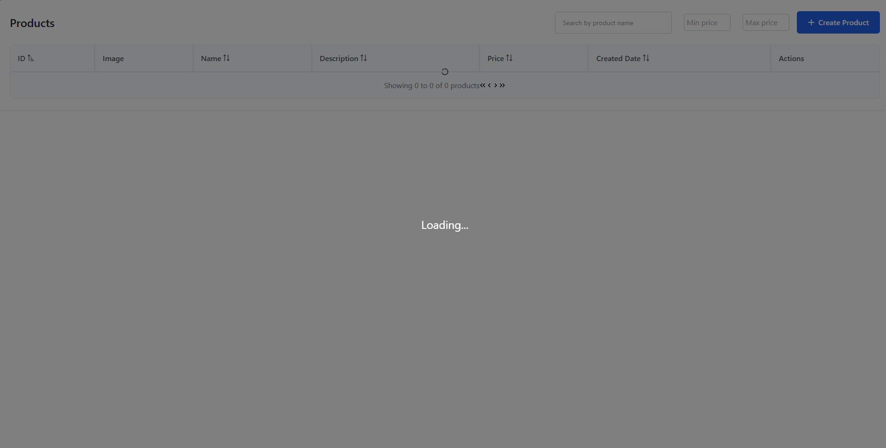
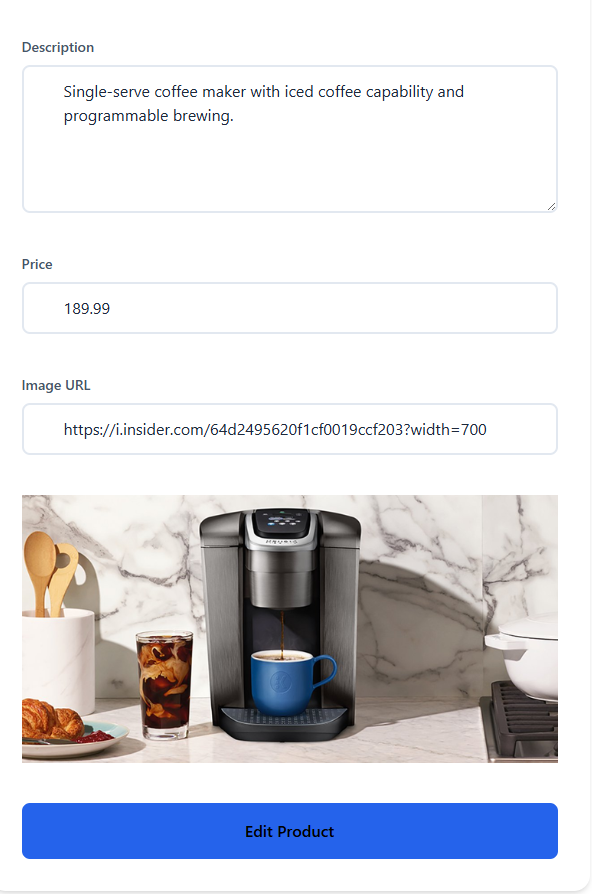
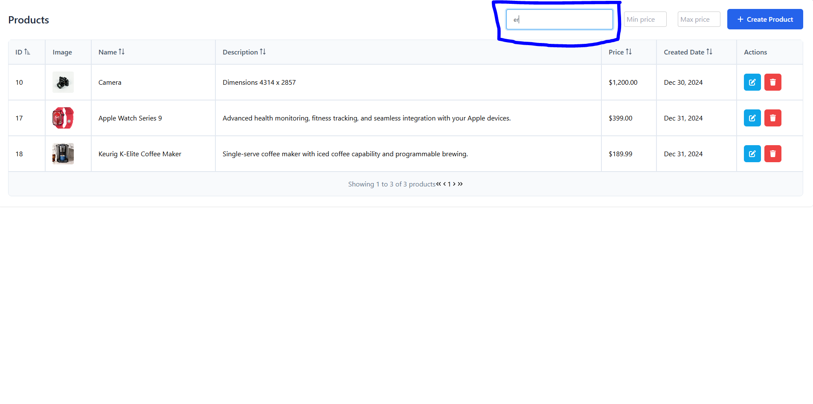

# Product Management System

A simple product management system built using .NET 8 Web **Minimal API** for the backend and Angular 19 with standalone components for the frontend.

- `Time takes` = 24 Hours

### Installation

#### Backend

1. Clone the repository:
   ```bash
   git clone https://github.com/MohamedHazem5/UrWave-Product-Managment-Task.git
   cd ProductManagementSystem
   ```

2. Restore NuGet packages:
   ```bash
   dotnet restore
   ```

3. Update `appsettings.json` with your database connection string. [I use Local Database] 

4. Run the database migration:
   ```bash
   dotnet ef database update
   ```

5. Start the application:
   ```bash
   dotnet run
   ```

#### Frontend

1. Navigate to the frontend directory:
   ```bash
   cd product-management-frontend
   ```

2. Install dependencies:
   ```bash
   npm install
   ```

3. Start the development server:
   ```bash
   ng serve
   ```

### Access the Application

- Open your browser and navigate to: [http://localhost:4200](http://localhost:4200)




## Back-End Features
- Minimal API for a lightweight, modern approach
- Repository Pattern
- Logging
- Unit Tests
- Error Handling Middleware
- Simple validation using FluentValidation
- Uses request/response DTOs
- Make endpoint groups for organization
- `Add Seeding for database`

## Front-End Features
1. **Products List Page**
   - Display products using PrimeNG Datatable.
   - Columns: ID, Name, Description, Price, Created Date.
   - Search by product name and sorting for all columns.
   - Sorting for all columns
   - Loading indicator [Bonus]
   - Price range filter [Bonus]
   - Image Url Preview [Bonus]
   

2. **Create Product Page**
   - Form fields: Name, Description, Price (with validations).
   - Validation: Required fields, max character limits, and positive price value.
   - Notifications: Success and validation error messages.

   

3. **Edit Product Page**
   - Pre-filled form with product data for editing.
   - Same validations as the Create Product Page.
   - Notifications: Success/Error messages.

   

4. **Delete Product**
   - Confirmation dialog before deletion.
   - Notifications: Success/Error messages.

   

## Setup Instructions

### Prerequisites

- **Backend**
  - .NET 8 SDK
  - SQL Server (Express or Developer Edition)
  - Entity Framework Core

- **Frontend**
  - Node.js (Latest LTS version)
  - Angular CLI

## Bonus Features

1. **Loading Indicators**
   - Added during API calls.

   

2. **Product Image URL Field**
   - Added a field for product image URLs and displayed images in the product list.

   

3. **Search by name Filter**
   - Enabled filtering products by product's name.

   

4. **Basic Unit Tests**
   - Included tests for critical functionality.

## Submission Details

- GitHub Repository URL: [Repository URL](https://github.com/MohamedHazem5/UrWave-Product-Managment-Task)
- Database Creation Script: Included in the repository in file name `DatabaseScript.md` and i will provide it here also.

- ## Step 1: Create the database
```bash
CREATE DATABASE UrWaveProductDB;
```
## Step 2: Switch to the newly created database
```bash
USE UrWaveProductDB;
```
## Step 3: Create the Product table
```bash
CREATE TABLE Product (
    Id INT PRIMARY KEY IDENTITY(1,1), -- Auto-incrementing primary key
    Name NVARCHAR(255) NOT NULL,       -- Product name (max length of 255 characters)
    Description NVARCHAR(MAX) NOT NULL, -- Product description (can store large text)
    Price FLOAT NOT NULL,              -- Product price
    CreatedDate DATETIME NOT NULL DEFAULT GETUTCDATE(), -- Created date (defaults to UTC now)
    ImageUrl NVARCHAR(2083) NOT NULL   -- Image URL (maximum length of URL allowed in SQL Server)
);
```
## Step 4: Verify the table and sample data
```bash
SELECT * FROM Product;
```

## Technical Overview

### Backend

- **Framework**: .NET 8 Web Minimal API
- **Database**: SQL Server
- **Libraries**:
  - FluentValidation for request validation.
  - Middleware for error handling.

### Frontend

- **Framework**: Angular 19
- **Styling**: Basic CSS
- **Libraries**:
  - PrimeNG components for UI.

---


